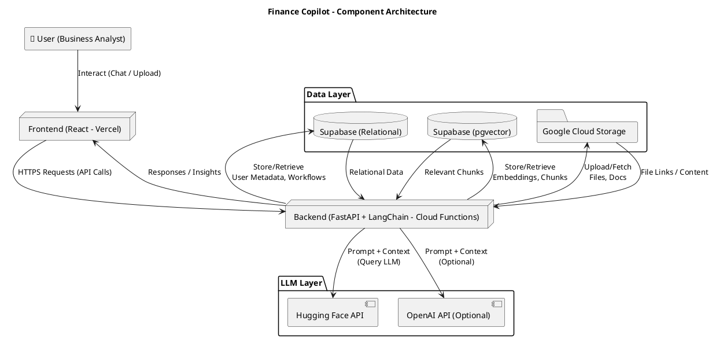
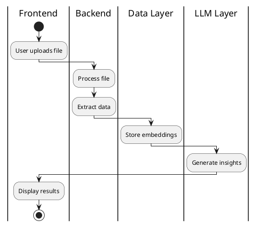

# Finance Copilot - Architecture Documentation

## Overview

A comprehensive AI-powered finance assistant built with modern tech stack to help business analysts with financial data processing, analysis, and insights generation.

## Component Architecture

### High-Level Architecture Diagram



## Tech Stack

### Frontend
- **Framework**: React.js
- **Deployment**: Vercel
- **Features**: Chat interface, File upload, Real-time updates

### Backend
- **Framework**: FastAPI
- **LLM Integration**: LangChain
- **Deployment**: Google Cloud Functions
- **Features**: RESTful APIs, Document processing, Vector search

### Data Layer
- **Primary Database**: Supabase (PostgreSQL)
- **Vector Database**: Supabase with pgvector extension
- **File Storage**: Google Cloud Storage
- **Use Cases**: 
  - User metadata and workflow storage
  - Document embeddings and semantic search
  - File and document storage

### AI/LLM Layer
- **Primary**: Hugging Face API
- **Secondary**: OpenAI API (Optional)
- **Capabilities**: Natural language processing, Financial analysis, Insight generation

## Diagram Export Guide

### Exporting PlantUML Diagrams

#### 1. PlantUML Online Editor
1. Open [PlantUML Online Editor](https://www.plantuml.com/plantuml/uml/)
2. Paste your PlantUML code
3. Download as **SVG** or **PNG**

#### 2. VS Code + PlantUML Extension
1. Install the *PlantUML* extension
2. Open `.puml` file
3. Right-click → **Export Current Diagram** → Choose **SVG**

#### 3. Command Line Interface
```bash
# Installation
# Mac
brew install plantuml

# Ubuntu
sudo apt install plantuml

# Export commands
plantuml -tsvg diagram.puml    # Export as SVG
plantuml -tpng diagram.puml    # Export as PNG
```

**💡 Pro Tip**: SVG format is recommended as it scales without pixelation, perfect for documentation, presentations, and web applications.

## Diagramming Tool Comparison

### 🟢 PlantUML
**Best for**: Enterprise diagrams (component, class, deployment, C4 model)

**Strengths**:
- Supports swimlanes in activity diagrams
- Excellent for process flows
- Strong theming and export options (SVG/PNG/PDF)
- Industry standard for architecture documentation

### 🔵 D2 (Terrastruct)
**Best for**: Modern, clean syntax diagrams

**Strengths**:
- Auto-layout capabilities
- Fast prototyping
- Modern developer tooling integration
- Clean, minimalist output

**Swimlanes**: Can be simulated using group or container blocks

### 🟣 Python Diagrams (Mingrammer)
**Best for**: Infrastructure architecture visualization

**Strengths**:
- Write diagrams in Python code
- Includes official cloud provider icons (AWS, GCP, Azure)
- Perfect for cloud infrastructure visualization
- Programmatic diagram generation

**Limitations**: Less suited for swimlanes, but supports element clustering

## Swimlane Implementation

### PlantUML Activity Diagrams


### D2 Group Blocks
```d2
frontend: {
  shape: rectangle
  user_action: "Upload File"
}

backend: {
  shape: rectangle
  process: "Extract & Process"
}

data_layer: {
  shape: rectangle
  store: "Store Embeddings"
}
```

## Best Practices

### Tool Selection Guidelines

| Use Case | Recommended Tool | Reason |
|----------|------------------|---------|
| Formal enterprise documentation | PlantUML | Industry standard, comprehensive features |
| Quick prototyping & modern docs | D2 | Clean syntax, auto-layout |
| Cloud infrastructure mapping | Python Diagrams | Official cloud icons, programmatic |
| Process flows with swimlanes | PlantUML | Native swimlane support |

### Export Recommendations
- **Documentation**: SVG format for scalability
- **Presentations**: PNG with high DPI
- **Web Integration**: SVG for responsive design
- **Print Materials**: PDF export from PlantUML

## Implementation Notes

- All diagrams should be version controlled alongside code
- Use consistent naming conventions across all architectural diagrams
- Keep diagrams updated with system changes
- Consider using diagram-as-code approach for maintainability

---

*Last Updated: September 2025*